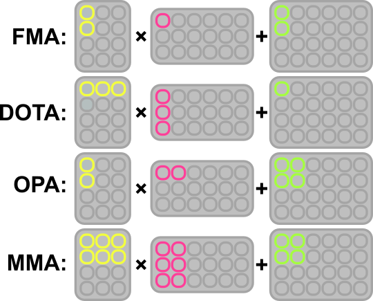
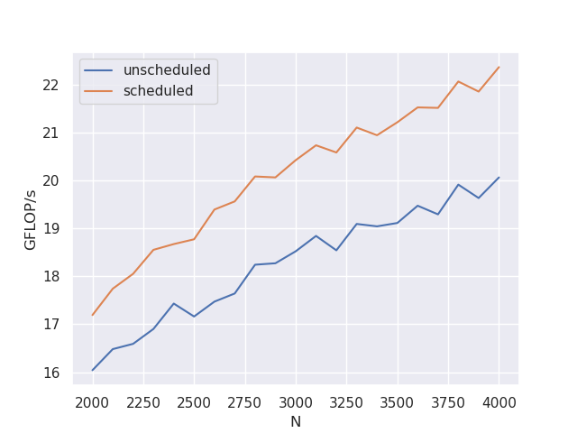

# Generator Overview

ukrgen consists of multiple abstractions and systems that create compute kernels from a few input parameters

generator stages (in-order):
1. `support_stage`
2. `datatype_stage`
3. `dimension_stage`
4. `tif_stage`
5. `model_stage`
6. `specialize_stage`
7. `irmod_inserter_stage`
8. `mru_stage`
9. `schedule_stage`
10. `codegen_stage`


## Tile-Instruction-Format

The highest level of abstraction in ukrgen is the Tile-Instruction-Format - TIF. This is a sequence of transformations of named [2D tiles](https://github.com/linedot/ukrgen/blob/fix_lineno_for_doc/src/ukrgen/components/tile.py#L60). For a CPU ISA, tiles correspond to different types of operands/registers and the transformations correspond to different instructions. The tile "names" are called components and abstractly represent different (or the same) input and output memory locations. The 2D-indices in the TIF are offsets in numbers of elements. VLA registers and lane indexes are also supported and show as `N*VLEN` and `M.el(N)` in the printed representation respectively.

### Instruction abstraction

Abstraction over different arithmetic instructions by treating them as partial matrix multiplications:



### Supported transformations and tiles

`ukrgen` relies heavily on [`asmgen`](https://github.com/linedot/asmgen) for supporting different ISAs. While the TIF itself is highly abstract, the parameters to the `tif_stage` in the generator are constrained by what is supported in the chosen ISA. `ukrgen` [iterates through all possible variants](https://github.com/linedot/ukrgen/blob/fix_lineno_for_doc/src/ukrgen/specializers/asm.py#L581-L638) of instructions in `asmgen` and tracks which are supported in the `support_stage`. Whether the TIF can be generated at all, the shape of the 2D tiles and the TIF indexing depend on the outcome of that stage.


### Generators

The TIF is an input to later stages of the generation process, but it is itself also an output of a high-level generator specific to the desired compute kernel. Currently only the [`mm` generator](https://github.com/linedot/ukrgen/blob/fix_lineno_for_doc/src/ukrgen/generators/mm.py) is implemented, generating TIFs for matrix multiplication kernels.

Some TIF examples (all for FP32):

isa=sme, op=opa, m=2, n=2, k=1 :

```
AB(0*VLEN,0*VLEN) <- fopa(A(0*VLEN,0),B(0,0*VLEN),AB(0*VLEN,0*VLEN))
AB(1*VLEN,0*VLEN) <- fopa(A(1*VLEN,0),B(0,0*VLEN),AB(1*VLEN,0*VLEN))
AB(0*VLEN,1*VLEN) <- fopa(A(0*VLEN,0),B(0,1*VLEN),AB(0*VLEN,1*VLEN))
AB(1*VLEN,1*VLEN) <- fopa(A(1*VLEN,0),B(0,1*VLEN),AB(1*VLEN,1*VLEN))
```

isa=avx512, op=fma, m=2, n=4, k=1:
```
AB(0,0) <- fma(A(0,0),B(0,0),AB(0,0))
AB(16,0) <- fma(A(16,0),B(0,0),AB(16,0))
AB(0,1) <- fma(A(0,0),B(0,1),AB(0,1))
AB(16,1) <- fma(A(16,0),B(0,1),AB(16,1))
AB(0,2) <- fma(A(0,0),B(0,2),AB(0,2))
AB(16,2) <- fma(A(16,0),B(0,2),AB(16,2))
AB(0,3) <- fma(A(0,0),B(0,3),AB(0,3))
AB(16,3) <- fma(A(16,0),B(0,3),AB(16,3))
```

isa=rvv, op=fma, m=2, n=4, k=1, vecdir=M:
```
AB(0*VLEN,0) <- fma(A(0*VLEN,0),B(0,0),AB(0*VLEN,0))
AB(1*VLEN,0) <- fma(A(1*VLEN,0),B(0,0),AB(1*VLEN,0))
AB(0*VLEN,1) <- fma(A(0*VLEN,0),B(0,1),AB(0*VLEN,1))
AB(1*VLEN,1) <- fma(A(1*VLEN,0),B(0,1),AB(1*VLEN,1))
AB(0*VLEN,2) <- fma(A(0*VLEN,0),B(0,2),AB(0*VLEN,2))
AB(1*VLEN,2) <- fma(A(1*VLEN,0),B(0,2),AB(1*VLEN,2))
AB(0*VLEN,3) <- fma(A(0*VLEN,0),B(0,3),AB(0*VLEN,3))
AB(1*VLEN,3) <- fma(A(1*VLEN,0),B(0,3),AB(1*VLEN,3))
```

isa=rvv, op=fma, m=2, n=4, k=1, vecdir=N, order=mnkMNK:

```
AB(0,0*VLEN) <- fma(A(0,0),B(0,0*VLEN),AB(0,0*VLEN))
AB(1,0*VLEN) <- fma(A(1,0),B(0,0*VLEN),AB(1,0*VLEN))
AB(0,1*VLEN) <- fma(A(0,0),B(0,1*VLEN),AB(0,1*VLEN))
AB(1,1*VLEN) <- fma(A(1,0),B(0,1*VLEN),AB(1,1*VLEN))
AB(0,2*VLEN) <- fma(A(0,0),B(0,2*VLEN),AB(0,2*VLEN))
AB(1,2*VLEN) <- fma(A(1,0),B(0,2*VLEN),AB(1,2*VLEN))
AB(0,3*VLEN) <- fma(A(0,0),B(0,3*VLEN),AB(0,3*VLEN))
AB(1,3*VLEN) <- fma(A(1,0),B(0,3*VLEN),AB(1,3*VLEN))
```
isa=rvv, op=fma, m=2, n=4, k=1, vecdir=N, order=nmkNMK:

```
AB(0,0*VLEN) <- fma(A(0,0),B(0,0*VLEN),AB(0,0*VLEN))
AB(0,1*VLEN) <- fma(A(0,0),B(0,1*VLEN),AB(0,1*VLEN))
AB(0,2*VLEN) <- fma(A(0,0),B(0,2*VLEN),AB(0,2*VLEN))
AB(0,3*VLEN) <- fma(A(0,0),B(0,3*VLEN),AB(0,3*VLEN))
AB(1,0*VLEN) <- fma(A(1,0),B(0,0*VLEN),AB(1,0*VLEN))
AB(1,1*VLEN) <- fma(A(1,0),B(0,1*VLEN),AB(1,1*VLEN))
AB(1,2*VLEN) <- fma(A(1,0),B(0,2*VLEN),AB(1,2*VLEN))
AB(1,3*VLEN) <- fma(A(1,0),B(0,3*VLEN),AB(1,3*VLEN))
```


## Execution model

The TIF is then input to the execution model. Currently only a [load-store cpu model](https://github.com/linedot/ukrgen/blob/fix_lineno_for_doc/src/ukrgen/models/load_store_cpu.py) is implemented.

The LSC model utilizes something like an IR to map TIFs onto [operations on data and address registers](https://github.com/linedot/ukrgen/blob/fix_lineno_for_doc/src/ukrgen/models/load_store_operations.py). The number of abstract per-component registers to use for data and addresses are inputs to the `model_stage`. It is [stateful](https://github.com/linedot/ukrgen/blob/fix_lineno_for_doc/src/ukrgen/models/load_store_cpu.py#L44-L50), with the states keeping track of address offsets (do=data origin) saved in address and data registers. [Offset mappers](https://github.com/linedot/ukrgen/blob/fix_lineno_for_doc/src/ukrgen/models/offset_mapper.py) map the 2D TIF indices onto [complex offsets](https://github.com/linedot/ukrgen/blob/fix_lineno_for_doc/src/ukrgen/models/lsc/offset.py), which, while being 1D, consist of a sum of products between integers, strides and VLA vector lengths

After the index is mapped onto an `lsc_offset`, the model tries to resolve the data, [first checking whether any register already has the data](https://github.com/linedot/ukrgen/blob/fix_lineno_for_doc/src/ukrgen/models/load_store_cpu.py#L278-L285) and if none do, using the [`resolve_data()` method](https://github.com/linedot/ukrgen/blob/fix_lineno_for_doc/src/ukrgen/models/load_store_cpu.py#L105) to place the data into a register. The register choice here is very simple: [a rotating index is used](https://github.com/linedot/ukrgen/blob/fix_lineno_for_doc/src/ukrgen/models/load_store_cpu.py#L289-L292), iterating through the available data registers in order with defined index steps. In order to place the data into a data register, a load operation has to be emitted. This requires an address register that contains the correct offset. The [`addr_resolver` class](https://github.com/linedot/ukrgen/blob/fix_lineno_for_doc/src/ukrgen/models/addr_resolver.py) is used by the model to choose a suitable address register. [Resolving the address](https://github.com/linedot/ukrgen/blob/fix_lineno_for_doc/src/ukrgen/models/load_store_cpu.py#L145) will return the address register index, the offset to use with the load, as well as a list of [`addr_add`](https://github.com/linedot/ukrgen/blob/fix_lineno_for_doc/src/ukrgen/models/addr_resolver.py#L20) objects that need to be converted into [address increment operations](https://github.com/linedot/ukrgen/blob/fix_lineno_for_doc/src/ukrgen/models/load_store_operations.py#L207) to be emitted before the load in order for the address register to contain the valid offset. When storing the data back to memory, the [same method is used](https://github.com/linedot/ukrgen/blob/fix_lineno_for_doc/src/ukrgen/models/load_store_cpu.py#L183-L195) to determine which address register to use for the store. This process is also heavily influenced by the chosen underlying ISA, especially regarding valid load/store offsets, and valid parameters are calculated by [querying `asmgen` objects and various other parameters](https://github.com/linedot/ukrgen/blob/fix_lineno_for_doc/src/ukrgen/models/addr_parameters.py#L17-L99).

## Pre-specialization/IR modification

## Software scheduling

[A simple instruction scheduler](https://github.com/linedot/ukrgen/blob/fix_lineno_for_doc/src/ukrgen/schedulers/simple_dependency_scheduler.py) is implemented that allows maintaining "distance" between dependent instructions. Here, "distance" means number of independent instructions between two dependent ones. The scheduling algorithms is rather naive - it iterates through the instructions and checks their "distance" to the already scheduled instructions. If an unfulfilled distance constraint is encountered, the scheduler tries to "move" instructions "up" in the schedule until it is fulfilled, keeping track of the distances through the process and moving other instructions up as well if constraints would be violated by the move. In case the constraints cannot be fulfilled, [the scheduler fails](https://github.com/linedot/ukrgen/blob/fix_lineno_for_doc/src/ukrgen/schedulers/simple_dependency_scheduler.py#L119)

### Impact

Impact of sw scheduling on SpacemiT K1/X60:



### Future work

A graph-based scheduler and/or an ILP-solver-based scheduler could potentially prove to be beneficial. One shortcoming of the simple scheduler is that it doesn't account for the available resources/pipelines in the processor directly and has no concept of instruction "patterns" and orderings that can be performant. Compilers usually have internal performance models that are to some degree aware of those microarchitectural idiosyncrasies and can take them into account when generating code.

## Specialization into ASM

## Codegen
